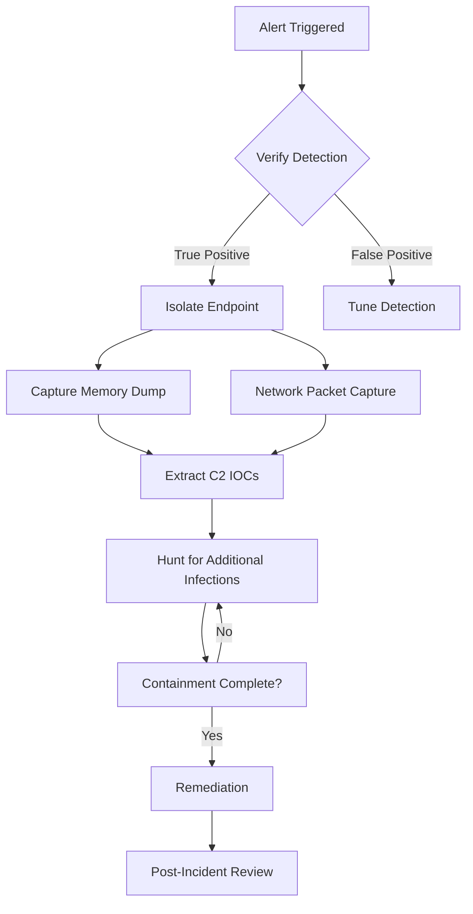

# AsyncRAT Threat Hunting Playbook
**Version:** 1.0  
**Author:** Security Analysis Team  
**Date:** 2025-12-18  
**Classification:** TLP:WHITE

---

## Table of Contents
1. [Executive Summary](#executive-summary)
2. [Threat Intelligence Summary](#threat-intelligence-summary)
3. [Hunting Hypotheses](#hunting-hypotheses)
4. [Data Sources Required](#data-sources-required)
5. [Hunting Procedures](#hunting-procedures)
6. [Analysis Workflows](#analysis-workflows)
7. [Response Procedures](#response-procedures)
8. [Indicators of Compromise](#indicators-of-compromise)

---

## Executive Summary

### Purpose
This playbook provides structured threat hunting procedures for detecting AsyncRAT infections across enterprise environments. AsyncRAT is a prevalent Remote Access Trojan that has been observed in numerous campaigns targeting critical infrastructure, with particular focus on U.S. infrastructure, hospitality, and financial sectors.

### Scope
- **Malware Family:** AsyncRAT / Async_RAT / AsyncRAT-C-Sharp
- **Threat Level:** Critical
- **Target Sectors:** Healthcare, Finance, Government, Manufacturing, Hospitality
- **Hunting Duration:** Continuous with periodic deep dives (recommend monthly)
- **Prerequisites:** EDR/XDR, SIEM, Network monitoring, Memory forensics capability

### Key Findings to Hunt For
- SSL certificates with "AsyncRAT Server" Common Name
- Connections to port 6606 (default C2)
- Process injection into aspnet_compiler.exe, RegSvcs.exe, explorer.exe
- Python-based loaders in %TEMP% directories
- Scheduled tasks named "Skype Updater" or similar
- OneNote documents spawning mshta.exe or PowerShell
- TryCloudflare tunnel usage
- Telegram bot exfiltration activity

---

## Threat Intelligence Summary

### Adversary Profile
- **Threat Actors:** Multiple groups including Storm-1865, Desert Dexter, Earth Berberoka, TA2541, UNC2500
- **Sophistication:** Medium to High
- **Motivation:** Financial gain, espionage, credential theft
- **TTPs:** Phishing, exploit kits, social engineering (ClickFix), legitimate infrastructure abuse

### Recent Campaign Activity
| Campaign | Active Period | Target | Distribution |
|----------|---------------|--------|--------------|
| ClickFix (Storm-1865) | Dec 2024 - Present | Hospitality | Fake Booking.com emails |
| Desert Dexter | Sep 2024 - Present | MENA Region | Facebook ads, crypto targeting |
| Python Loader | Nov 2024 - Present | Global | Dropbox + TryCloudflare |
| OneNote Campaign | Q1 2024 - Present | Global | Malicious .one attachments |

### MITRE ATT&CK Framework
```
Initial Access: T1566 (Phishing), T1189 (Drive-by)
Execution: T1059.001 (PowerShell), T1059.005 (VBS)
Persistence: T1053.005 (Scheduled Task), T1547.001 (Registry Run Keys)
Defense Evasion: T1055 (Process Injection), T1027 (Obfuscation), T1562.001 (Disable Tools)
Credential Access: T1056.001 (Keylogging), T1555 (Password Stores)
Discovery: T1082 (System Info), T1497 (Virtualization Detection)
Collection: T1113 (Screen Capture), T1125 (Video Capture)
C2: T1071.001 (Web Protocols), T1573.001 (Symmetric Crypto)
Exfiltration: T1041 (C2 Channel)
```

---

## Hunting Hypotheses

### Hypothesis 1: AsyncRAT C2 Communication
**Assumption:** AsyncRAT uses distinctive SSL certificates for C2 communication  
**Validation:** Search for SSL connections with "AsyncRAT Server" in certificate CN  
**Priority:** Critical  
**Data Sources:** Network traffic, SSL/TLS logs, firewall logs

### Hypothesis 2: Process Injection into Legitimate Binaries
**Assumption:** AsyncRAT commonly injects into aspnet_compiler.exe or RegSvcs.exe  
**Validation:** Identify these processes with unusual network connections  
**Priority:** High  
**Data Sources:** EDR process telemetry, network connections, Sysmon

### Hypothesis 3: Python-Based Loader Execution
**Assumption:** Recent campaigns use Python scripts to inject shellcode  
**Validation:** Find python.exe executing from %TEMP% with suspicious imports  
**Priority:** High  
**Data Sources:** Process creation logs, file system monitoring, command-line logging

### Hypothesis 4: OneNote Document Weaponization
**Assumption:** OneNote files dropping HTA/BAT scripts indicate AsyncRAT delivery  
**Validation:** Monitor OneNote spawning scripting interpreters  
**Priority:** Medium  
**Data Sources:** Process creation, file creation, email gateway logs

### Hypothesis 5: Persistence via Scheduled Tasks
**Assumption:** AsyncRAT creates scheduled tasks with deceptive names  
**Validation:** Enumerate scheduled tasks with suspicious properties  
**Priority:** Medium  
**Data Sources:** Windows Event Logs (Task Scheduler), registry monitoring

### Hypothesis 6: Cryptocurrency Wallet Targeting
**Assumption:** Desert Dexter variant targets browser wallet extensions  
**Validation:** Detect file access to wallet extension directories  
**Priority:** Medium  
**Data Sources:** File access logs, browser process monitoring

### Hypothesis 7: Telegram Bot Exfiltration
**Assumption:** Some variants exfiltrate via Telegram API  
**Validation:** Non-browser processes connecting to api.telegram.org  
**Priority:** Medium  
**Data Sources:** Network traffic, DNS logs, proxy logs

### Hypothesis 8: ClickFix Social Engineering
**Assumption:** Users are tricked into executing malicious commands via fake CAPTCHA  
**Validation:** Detect mshta.exe spawned from browsers  
**Priority:** High  
**Data Sources:** Process creation, browser telemetry, web proxy

---

## Data Sources Required

### Essential Data Sources
1. **Endpoint Detection & Response (EDR)**
   - Process creation events
   - Process injection events
   - File system modifications
   - Registry changes
   - Memory analysis

2. **Network Traffic**
   - SSL/TLS certificate inspection
   - Full packet capture (PCAP)
   - NetFlow data
   - DNS query logs

3. **SIEM/Log Aggregation**
   - Windows Event Logs (Security, System, Application)
   - Sysmon logs
   - PowerShell logs
   - Email gateway logs

4. **Email Security**
   - Email headers
   - Attachment analysis
   - URL filtering logs

### Optional but Recommended
- Web proxy logs
- Firewall logs
- Threat intelligence feeds
- Sandbox/malware analysis results
- User authentication logs

### Log Retention Requirements
- **Minimum:** 90 days for network and endpoint logs
- **Recommended:** 180 days for correlation and campaign tracking
- **Critical:** Real-time alerting on high-confidence indicators

---

## Hunting Procedures

### Hunt 1: SSL Certificate Hunting

**Objective:** Identify AsyncRAT C2 connections via SSL certificates

**Query Examples:**

**Splunk:**
```spl
index=network_traffic 
    (ssl_issuer="*AsyncRAT*" OR ssl_subject="*AsyncRAT*" OR ssl_issuer="CN=AsyncRAT Server")
| stats count by src_ip, dest_ip, dest_port, ssl_subject, ssl_issuer
| where dest_port IN (6606, 8808, 3232, 4056, 7777, 8888)
| sort -count
```

**Elastic/ELK:**
```json
{
  "query": {
    "bool": {
      "should": [
        { "wildcard": { "tls.server.subject": "*AsyncRAT*" }},
        { "wildcard": { "tls.server.issuer": "*AsyncRAT*" }},
        { "match": { "tls.server.subject": "CN=AsyncRAT Server" }}
      ],
      "minimum_should_match": 1
    }
  }
}
```

**KQL (Microsoft Sentinel):**
```kql
DeviceNetworkEvents
| where RemotePort in (6606, 8808, 3232, 4056)
| where TlsInspectionResults contains "AsyncRAT"
    or ServerCertificateIssuer contains "AsyncRAT"
    or ServerCertificateSubject contains "AsyncRAT"
| summarize Count=count() by DeviceName, RemoteIP, RemotePort, ServerCertificateSubject
| order by Count desc
```

**Expected Results:** 0-2 endpoints (in clean environment)  
**Escalation Threshold:** Any detection is critical  
**Next Steps:** Isolate host, capture memory, analyze certificate chain

---

### Hunt 2: Process Injection Indicators

**Objective:** Detect AsyncRAT injection into aspnet_compiler.exe and RegSvcs.exe

**Splunk:**
```spl
index=endpoint_data sourcetype=sysmon EventCode=1
    (Image="*\\aspnet_compiler.exe" OR Image="*\\RegSvcs.exe")
    (ParentImage="*\\powershell.exe" OR ParentImage="*\\cmd.exe" 
     OR ParentImage="*\\wscript.exe" OR ParentImage="*\\mshta.exe")
| stats count by ComputerName, Image, ParentImage, CommandLine, User
| sort -count
```

**Network Connection from Suspicious Processes:**
```spl
index=network_traffic 
    (process_name="aspnet_compiler.exe" OR process_name="RegSvcs.exe")
    dest_port!=80 AND dest_port!=443
| stats values(dest_ip) as Destinations, values(dest_port) as Ports by src_host, process_name
```

**KQL:**
```kql
DeviceProcessEvents
| where FileName in~ ("aspnet_compiler.exe", "RegSvcs.exe")
| where InitiatingProcessFileName in~ ("powershell.exe", "cmd.exe", "wscript.exe", "mshta.exe")
| join kind=inner (
    DeviceNetworkEvents
    | where InitiatingProcessFileName in~ ("aspnet_compiler.exe", "RegSvcs.exe")
    | where RemotePort !in (80, 443)
) on DeviceId, InitiatingProcessId
| project Timestamp, DeviceName, FileName, ProcessCommandLine, 
          RemoteIP, RemotePort, InitiatingProcessFileName
```

**Expected Results:** 0 (these processes should not have network activity)  
**Escalation Threshold:** Any match  
**Next Steps:** Memory dump, network capture, check for DLL injection

---

### Hunt 3: Python Loader Detection

**Objective:** Find Python-based AsyncRAT loaders

**File System Hunt:**
```spl
index=endpoint_data sourcetype=sysmon EventCode=11
    (TargetFilename="*\\Temp\\*.py" OR TargetFilename="*\\AppData\\*\\*.py")
| stats count by ComputerName, TargetFilename, Image, User
```

**Process Execution Hunt:**
```spl
index=endpoint_data sourcetype=sysmon EventCode=1
    (Image="*\\python.exe" OR Image="*\\pythonw.exe")
    CommandLine IN ("*load.py*", "*.bin*", "*VirtualAlloc*", "*CreateThread*")
| eval suspicious_score = 0
| eval suspicious_score = if(match(CommandLine, "(?i)load\.py"), suspicious_score + 3, suspicious_score)
| eval suspicious_score = if(match(CommandLine, "(?i)\.bin"), suspicious_score + 2, suspicious_score)
| eval suspicious_score = if(match(CommandLine, "(?i)VirtualAlloc|CreateThread"), suspicious_score + 5, suspicious_score)
| where suspicious_score >= 3
| table _time, ComputerName, Image, CommandLine, ParentImage, suspicious_score
| sort -suspicious_score
```

**KQL:**
```kql
DeviceFileEvents
| where FolderPath has_any ("\\Temp\\", "\\AppData\\")
| where FileName endswith ".py" or FileName endswith ".bin"
| join kind=inner (
    DeviceProcessEvents
    | where FileName in~ ("python.exe", "pythonw.exe")
    | where ProcessCommandLine has_any ("load.py", ".bin", "ctypes", "VirtualAlloc")
) on DeviceId
| project Timestamp, DeviceName, FileName, FolderPath, ProcessCommandLine
```

**Expected Results:** Minimal legitimate Python activity in Temp  
**Escalation Threshold:** Python with "load.py" or ".bin" arguments  
**Next Steps:** Retrieve Python script, analyze for shellcode, check network connections

---

### Hunt 4: OneNote Dropper Detection

**Objective:** Identify malicious OneNote documents

**Splunk:**
```spl
index=endpoint_data sourcetype=sysmon EventCode=1
    ParentImage="*\\onenote.exe"
    (Image="*\\mshta.exe" OR Image="*\\wscript.exe" OR Image="*\\cscript.exe" 
     OR Image="*\\powershell.exe" OR Image="*\\cmd.exe")
| stats count by ComputerName, ParentImage, Image, CommandLine, User
| sort -count
```

**Email Analysis:**
```spl
index=email_logs attachment_extension=".one"
| stats count by sender, recipient, subject, attachment_name
| where count > 1  # Multiple recipients indicate campaign
```

**KQL:**
```kql
DeviceProcessEvents
| where InitiatingProcessFileName =~ "onenote.exe"
| where FileName in~ ("mshta.exe", "wscript.exe", "cscript.exe", "powershell.exe", "cmd.exe")
| project Timestamp, DeviceName, FileName, ProcessCommandLine, 
          InitiatingProcessCommandLine, AccountName
| order by Timestamp desc
```

**Expected Results:** Very rare legitimate behavior  
**Escalation Threshold:** Any detection  
**Next Steps:** Quarantine OneNote file, analyze embedded objects, check for follow-on activity

---

### Hunt 5: Scheduled Task Persistence

**Objective:** Enumerate suspicious scheduled tasks

**Splunk:**
```spl
index=windows_logs source=*TaskScheduler* EventCode=106
| rex field=TaskName "(?<task_name>[^\\]+)$"
| where match(task_name, "(?i)skype.*update|windows.*update|chrome.*update|system.*update")
    AND NOT match(Actions, "(?i)microsoft|google|skype")
| stats count by ComputerName, TaskName, Actions, UserId
```

**PowerShell Hunt (for live systems):**
```powershell
# Run on individual endpoints or via PSRemoting
Get-ScheduledTask | Where-Object {
    $_.TaskName -match "(?i)skype.*update|windows.*update|chrome.*update" -and
    $_.Actions.Execute -notmatch "(?i)microsoft|google|skype" -and
    $_.Actions.Execute -match "(?i)powershell|wscript|mshta|cmd"
} | Select-Object TaskName, TaskPath, State, 
    @{Name="Execute";Expression={$_.Actions.Execute}},
    @{Name="Arguments";Expression={$_.Actions.Arguments}}
```

**KQL:**
```kql
DeviceProcessEvents
| where FileName =~ "schtasks.exe"
| where ProcessCommandLine has "/create"
| where ProcessCommandLine has_any ("Skype Updater", "Windows Updater", "Chrome Updater")
| project Timestamp, DeviceName, ProcessCommandLine, AccountName
```

**Expected Results:** Known legitimate tasks only  
**Escalation Threshold:** Scheduled tasks with deceptive names pointing to suspicious paths  
**Next Steps:** Disable task, analyze target executable, check task history

---

### Hunt 6: AMSI/ETW Bypass Detection

**Objective:** Detect security tool tampering

**Splunk:**
```spl
index=endpoint_data sourcetype=sysmon EventCode=1
    Image="*\\powershell.exe"
    (CommandLine="*AmsiScanBuffer*" OR CommandLine="*amsi.dll*" 
     OR CommandLine="*EtwEventWrite*" OR CommandLine="*PatchETW*"
     OR CommandLine="*AmsiInitFailed*")
| stats count by ComputerName, CommandLine, User, ParentImage
| sort -count
```

**KQL:**
```kql
DeviceProcessEvents
| where FileName =~ "powershell.exe"
| where ProcessCommandLine has_any (
    "AmsiScanBuffer", "amsi.dll", "AmsiInitFailed",
    "EtwEventWrite", "PatchETW", "System.Management.Automation.AmsiUtils"
)
| project Timestamp, DeviceName, ProcessCommandLine, AccountName, InitiatingProcessFileName
| order by Timestamp desc
```

**Expected Results:** 0 in production environment  
**Escalation Threshold:** Any detection is critical  
**Next Steps:** Immediate isolation, memory forensics, check for active C2

---

### Hunt 7: TryCloudflare Infrastructure Abuse

**Objective:** Detect use of TryCloudflare tunnels for C2

**Splunk:**
```spl
index=dns_logs 
    query="*.trycloudflare.com"
    src_process!="chrome.exe" AND src_process!="firefox.exe" 
    AND src_process!="msedge.exe"
| stats count by src_host, src_process, query
| sort -count
```

**Network Traffic:**
```spl
index=network_traffic 
    dest_domain="*.trycloudflare.com"
| stats values(src_ip) as Sources, dc(src_ip) as UniqueHosts by dest_domain
| where UniqueHosts > 5  # Multiple hosts indicate campaign
```

**KQL:**
```kql
DeviceNetworkEvents
| where RemoteUrl endswith ".trycloudflare.com"
| where InitiatingProcessFileName !in~ ("chrome.exe", "firefox.exe", "msedge.exe", "iexplore.exe")
| summarize Count=count() by DeviceName, InitiatingProcessFileName, RemoteUrl
| order by Count desc
```

**Expected Results:** Minimal, mostly from browsers  
**Escalation Threshold:** Non-browser processes accessing TryCloudflare  
**Next Steps:** Analyze process, check for associated Python/PowerShell, network capture

---

### Hunt 8: Telegram Bot Exfiltration

**Objective:** Detect data exfiltration via Telegram

**Splunk:**
```spl
index=network_traffic 
    dest_domain="api.telegram.org"
    src_process!="telegram.exe" AND src_process!="chrome.exe" 
    AND src_process!="firefox.exe"
| stats count by src_host, src_process, uri_path, http_method
| where uri_path LIKE "%/sendMessage%" OR uri_path LIKE "%/sendPhoto%" 
    OR uri_path LIKE "%/sendDocument%"
```

**KQL:**
```kql
DeviceNetworkEvents
| where RemoteUrl contains "api.telegram.org"
| where RemoteUrl has_any ("/sendMessage", "/sendPhoto", "/sendDocument")
| where InitiatingProcessFileName !in~ ("telegram.exe", "chrome.exe", "firefox.exe", "msedge.exe")
| project Timestamp, DeviceName, InitiatingProcessFileName, RemoteUrl
| order by Timestamp desc
```

**Expected Results:** Only from Telegram client or browsers  
**Escalation Threshold:** System processes or scripts accessing Telegram API  
**Next Steps:** Identify bot token, check for stolen data in memory, review recent file access

---

### Hunt 9: Cryptocurrency Wallet Targeting

**Objective:** Detect access to browser wallet extensions

**Splunk:**
```spl
index=endpoint_data sourcetype=sysmon EventCode=11
    TargetFilename IN ("*\\MetaMask\\*", "*\\Phantom\\*", "*\\Coinbase Wallet\\*", 
                        "*\\Trust Wallet\\*", "*\\Binance\\*")
    Image!="*\\chrome.exe" AND Image!="*\\msedge.exe" AND Image!="*\\firefox.exe"
| stats count by ComputerName, Image, TargetFilename, User
```

**KQL:**
```kql
DeviceFileEvents
| where FolderPath has_any ("MetaMask", "Phantom", "Coinbase Wallet", "Trust Wallet", "Binance")
| where InitiatingProcessFileName !in~ ("chrome.exe", "msedge.exe", "firefox.exe", "brave.exe")
| project Timestamp, DeviceName, FileName, FolderPath, InitiatingProcessFileName, ActionType
```

**Expected Results:** Only browser access to wallet extensions  
**Escalation Threshold:** Non-browser processes accessing wallet directories  
**Next Steps:** Check for credential theft, review transaction history, isolate system

---

### Hunt 10: Memory-Only Execution

**Objective:** Detect fileless AsyncRAT execution

**Splunk:**
```spl
index=endpoint_data source=*process_memory*
    (memory_string="AsyncRAT" OR memory_string="Async_RAT" 
     OR memory_string="CN=AsyncRAT Server")
| stats count by ComputerName, process_name, process_id, memory_string
```

**EDR Memory Scan (if available):**
```powershell
# Requires EDR agent with memory scanning capability
Get-EDRMemoryScan -SearchString "AsyncRAT", "Async_RAT", "Plugin.dll" 
| Where-Object {$_.DetectionConfidence -eq "High"}
```

**Expected Results:** 0  
**Escalation Threshold:** Any match  
**Next Steps:** Full memory dump, process tree analysis, network forensics

---

## Analysis Workflows

### Workflow 1: Confirmed AsyncRAT Infection



### Workflow 2: Suspicious Activity Investigation

**Step 1: Initial Triage**
- [ ] Confirm alert is not false positive
- [ ] Check if endpoint is online
- [ ] Review recent user activity
- [ ] Check for similar alerts on other systems

**Step 2: Data Collection**
```powershell
# PowerShell script for rapid triage
$Computer = "HOSTNAME"

# Collect process list
Get-Process -ComputerName $Computer | Export-Csv "processes_$Computer.csv"

# Collect network connections
Get-NetTCPConnection -ComputerName $Computer | Export-Csv "connections_$Computer.csv"

# Collect scheduled tasks
Get-ScheduledTask -ComputerName $Computer | Export-Csv "tasks_$Computer.csv"

# Collect recent file creations
Get-ChildItem -Path "\\$Computer\C$\Users\*\AppData\*" -Recurse -File | 
    Where-Object {$_.CreationTime -gt (Get-Date).AddDays(-7)} |
    Export-Csv "recent_files_$Computer.csv"
```

**Step 3: Timeline Analysis**
1. Establish infection timeline
2. Identify patient zero
3. Map lateral movement
4. Document C2 communication

**Step 4: IOC Extraction**
- C2 IP addresses and domains
- File hashes (MD5, SHA1, SHA256)
- Registry keys
- Scheduled task names
- Mutex names
- SSL certificate fingerprints

---

## Response Procedures

### Immediate Response Actions

**Phase 1: Containment (0-1 hour)**

1. **Isolate Infected Systems**
   ```powershell
   # Disable network adapter
   Disable-NetAdapter -Name "Ethernet" -Confirm:$false
   
   # Or via EDR
   Invoke-EDRIsolation -ComputerName HOSTNAME
   ```

2. **Block C2 Communication**
   - Add C2 IPs to firewall block list
   - Block domains in DNS/proxy
   - Revoke SSL certificates if applicable

3. **Preserve Evidence**
   - Memory dump: `winpmem_v3.3.rc3.exe memdump.raw`
   - Disk image (if time permits)
   - Network packet capture

**Phase 2: Eradication (1-4 hours)**

1. **Remove Malware**
   ```powershell
   # Kill malicious processes
   Stop-Process -Name "aspnet_compiler", "RegSvcs" -Force
   
   # Remove scheduled tasks
   Unregister-ScheduledTask -TaskName "Skype Updater" -Confirm:$false
   
   # Remove registry persistence
   Remove-ItemProperty -Path "HKCU:\Software\Microsoft\Windows\CurrentVersion\Run" `
                        -Name "AsyncRAT" -ErrorAction SilentlyContinue
   
   # Delete malware files
   Remove-Item -Path "$env:TEMP\load.py" -Force -ErrorAction SilentlyContinue
   Remove-Item -Path "$env:TEMP\*.bin" -Force -ErrorAction SilentlyContinue
   ```

2. **Clean Browser Extensions**
   - Review and remove unauthorized extensions
   - Clear browser cache and cookies
   - Reset browser settings if necessary

3. **Verify Removal**
   - Rescan with updated AV signatures
   - Check for remaining persistence mechanisms
   - Validate no C2 beaconing

**Phase 3: Recovery (4-24 hours)**

1. **System Hardening**
   - Apply latest security patches
   - Enable additional logging (Sysmon, PowerShell)
   - Implement application whitelisting
   - Harden PowerShell execution policies

2. **Credential Reset**
   ```powershell
   # Force password reset for affected users
   Set-ADUser -Identity USERNAME -ChangePasswordAtLogon $true
   
   # Reset service account passwords
   # Invalidate cached credentials
   klist purge
   ```

3. **Monitoring Enhancement**
   - Deploy additional EDR agents
   - Enable enhanced logging
   - Implement network segmentation

**Phase 4: Post-Incident (24+ hours)**

1. **Root Cause Analysis**
   - How did initial infection occur?
   - What security controls failed?
   - What data was compromised?

2. **Lessons Learned**
   - Update detection rules
   - Enhance user training
   - Improve response procedures

3. **Threat Intelligence Sharing**
   - Submit IOCs to threat intel platforms
   - Share with ISACs/ISAOs
   - Update internal threat intel

---

## Indicators of Compromise

### File Hashes

**Recent AsyncRAT Samples (December 2025):**
```
SHA256: 2162988fd072a60aa21425a176fc865d989af773fa5c35b7a1fcada298b84ba1
MD5: 12e3fdc59be7f551e0f4520cf2d9e111
SHA1: b20f73860d549c216a7a4491f05365c71b8f5028
Imphash: f34d5f2d4577ed6d9ceec516c1f5a744

SHA256: 951cf36358700207066a5b20601cc5e13c7072fffb400aa34593a56a296ae4a6
MD5: 18eeabccf859b27be90af6616c7d1b4d
Imphash: 87bed5a7cba00c7e1f4015f1bdae2183

SHA256: ea847701b6d8ff6217c62c33c987037fa99fed338f69481c5a8ebc9d7fcde146
MD5: 05e5567e6a89264d015c257e26f68dc6
Signature: SalatStealer (AsyncRAT variant)
```

### Network IOCs

**C2 Infrastructure (December 2024 - Present):**
```
IP Addresses:
185.49.126.50:6606 (AS199654 Oxide Group Limited)
45.12.253.107:8808
62.60.190.141:3232
62.60.190.141:4056
172.245.5.61:38085
5.255.121.141
193.34.213.15

Domains:
*.trycloudflare.com (dynamic)
relay.shipperzone.online (ScreenConnect abuse)
inventory-card-thumbzilla-ip.trycloudflare.com
api.telegram.org (exfiltration)
```

**SSL/TLS Certificates:**
```
Issuer: CN=AsyncRAT Server
Subject: CN=AsyncRAT Server CA
Fingerprint: (varies by campaign)
```

### File System IOCs

**File Names:**
```
load.py
an.bin, pay.bin, payload.bin, ve.bin, xr.bin
12e3fdc59be7f551e0f4520cf2d9e111.exe
DMAcheat.exe
log.tmp (keylogger output)
```

**File Paths:**
```
%TEMP%\load.py
%TEMP%\*.bin
%APPDATA%\<random>\<random>.exe
%LOCALAPPDATA%\Temp\<random>.py
C:\Users\*\AppData\Local\Temp\log.tmp
```

### Registry IOCs

**Persistence Keys:**
```
HKCU\Software\Microsoft\Windows\CurrentVersion\Run\AsyncRAT
HKCU\Software\Microsoft\Windows\CurrentVersion\Run\System Update
HKLM\SOFTWARE\Microsoft\Windows\CurrentVersion\Run\Skype Updater
```

### Scheduled Task Names

```
Skype Updater
Windows Updater
Chrome Updater
System Update
<random alphanumeric>
```

### Mutex Names

```
AsyncMutex_<random>
AsyncRAT_Mutex
```

### Process Artifacts

**Injected Processes:**
```
aspnet_compiler.exe (with network connections)
RegSvcs.exe (with network connections)
notepad.exe (with network connections)
explorer.exe (with network connections)
```

**Parent-Child Relationships:**
```
onenote.exe → mshta.exe
outlook.exe → powershell.exe (with encoded commands)
chrome.exe → mshta.exe (ClickFix)
wscript.exe → powershell.exe → python.exe
```

---

## Recommended Tools

### Detection Tools
- **YARA:** Use rules from this playbook
- **Sigma:** SIEM correlation rules
- **Snort/Suricata:** Network-based detection
- **EDR:** CrowdStrike, SentinelOne, Microsoft Defender

### Analysis Tools
- **Volatility:** Memory forensics
- **Wireshark:** Network traffic analysis
- **Process Hacker:** Live process analysis
- **PEStudio:** Static malware analysis
- **dnSpy:** .NET decompilation
- **CyberChef:** Decoding/decryption

### Response Tools
- **PowerShell:** Automated response scripts
- **KAPE:** Forensic artifact collection
- **Velociraptor:** Endpoint visibility and hunting
- **TheHive/Cortex:** Incident response platform

---

## Metrics and KPIs

Track the following metrics to measure hunting effectiveness:

1. **Detection Metrics**
   - Time to detect (TTD)
   - Detection rate (% of infections found)
   - False positive rate

2. **Response Metrics**
   - Mean time to respond (MTTR)
   - Mean time to contain (MTTC)
   - Mean time to recover (MTTR2)

3. **Coverage Metrics**
   - % of endpoints with EDR
   - % of network traffic inspected
   - % of email attachments sandboxed

4. **Threat Intelligence**
   - IOCs identified per hunt
   - New TTPs discovered
   - Intelligence shared with community

---

## References

1. MalwareBazaar: https://bazaar.abuse.ch/
2. MITRE ATT&CK: https://attack.mitre.org/
3. Splunk AsyncRAT Analytic Story: https://www.splunk.com/en_us/blog/security/asyncrat-crusade-detections-and-defense.html
4. GitHub: https://github.com/NYAN-x-CAT/AsyncRAT-C-Sharp
5. Check Point Research: AsyncRAT campaigns and analysis
6. Trend Micro: AsyncRAT injection techniques
7. Forcepoint X-Labs: Python loader campaigns

---

## Playbook Maintenance

**Review Cycle:** Monthly  
**Owner:** Security Operations Center (SOC)  
**Contributors:** Threat Intelligence Team, Incident Response Team  
**Next Review Date:** 2025-01-18

**Change Log:**
- 2025-12-18: Initial version 1.0 created
