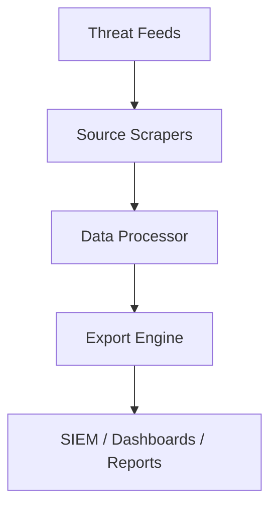

# Project Overview

## 🎯 Purpose
The **Threat Intelligence Aggregator** is a Python‑based tool that automates the collection, normalization, and consolidation of threat intelligence from multiple public security feeds.  
It is designed to support **SOC analysts, threat intelligence teams, and security researchers** by reducing manual effort and providing actionable intelligence in a single, searchable dataset.

---

## 🛡️ Professional Value
This project demonstrates:
- **Applied cybersecurity expertise**: CEH, SSCP, AZ‑500 training  
- **Hands‑on SOC and incident response skills**: automation, log analysis, threat hunting  
- **Strategic thinking**: blending military discipline with technical depth  
- **Enterprise readiness**: SIEM integration, roadmap for MISP/SOAR compatibility  

Recruiters and hiring managers can see how Python is used to solve **real-world cybersecurity challenges** with automation, scalability, and clarity.

---

## ⚙️ Architecture

### Core Components
1. **Source Scrapers**  
   - Collect data from multiple feeds (CISA, US‑CERT, The Hacker News, SANS ISC, OpenPhish).  
   - Support for API‑based sources (AlienVault OTX, GreyNoise, abuse.ch).  

2. **Data Processor**  
   - CVE extraction  
   - IOC identification  
   - Deduplication across feeds  
   - Keyword filtering (e.g., ransomware, zero‑day, APT)  
   - Severity classification  

3. **Export Engine**  
   - JSON → Machine‑readable for SIEM ingestion  
   - CSV → Spreadsheet‑compatible for analysis  
   - HTML → Human‑readable dashboard with statistics  

4. **Integration Layer**  
   - Splunk and ELK ingestion supported  
   - Roadmap for MISP and SOAR integration  

---

## 📂 Workflow

---

## 🔑 Key Capabilities
- **Daily Briefs**: Automated collection of overnight threats for SOC teams.  
- **Incident Response**: Rapid intelligence gathering during active investigations.  
- **Trend Analysis**: Historical data collection for research and threat actor studies.  
- **Compliance Reporting**: Export government advisories for regulatory documentation.  

---

## 📈 Performance
- Average scrape time: 30–60 seconds for all sources  
- Items collected: 100–200 per run (configurable)  
- Memory usage: ~50–100MB  
- Rate limiting: 1‑second delay between sources  

---

## 🔮 Roadmap Highlights
- API key support for premium feeds  
- MISP format export for community sharing  
- Automated scheduling and email alerts  
- Machine learning for threat prioritization  
- Dark web monitoring and threat actor attribution  
- SOAR integration for automated playbooks  

---
